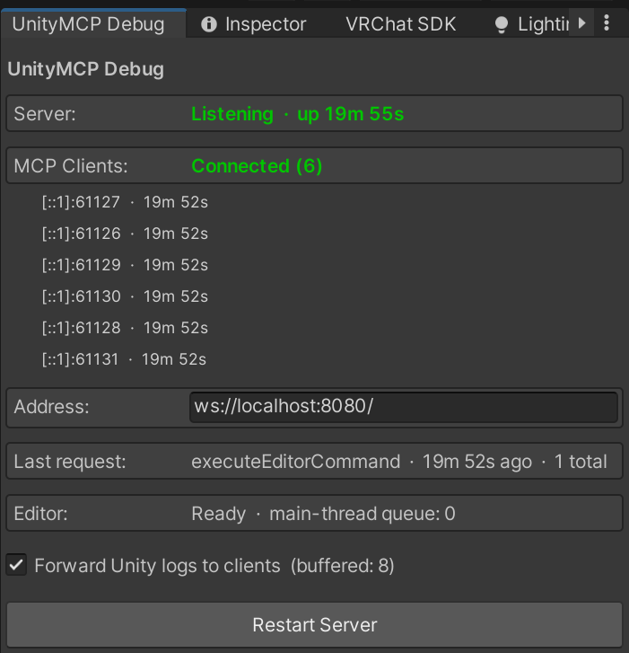

# UnityMCP-VRC

Drive the Unity Editor from Claude (or any MCP client). A Unity Editor **plugin** hosts
a WebSocket server inside the Editor, and a small **MCP server** (Node/TypeScript)
connects to it and exposes tools to Claude — run C# in the Editor, read editor/scene
state, and stream Unity console logs.

Forked from [Arodoid/UnityMCP](https://github.com/Arodoid/UnityMCP) and extensively
refactored, with a focus on using Claude to build **VRChat / UdonSharp** worlds — though
most of it works for ordinary Unity development too.

<p align="center">
  <br>
  <em>The Debug Window — six Claude sessions attached to a single Editor on <code>ws://localhost:8080</code>.</em>
</p>

## Highlights

- **One Editor, many Claude sessions.** The plugin hosts the server, so any number of
  Claude sessions can drive the same Editor at once — no fixed-port race, no
  "connected-but-dead" zombie servers.
- **Run real C#.** `execute_editor_command` runs LLM-authored C# (its own `using`s,
  classes, functions) with assembly references auto-discovered from everything loaded —
  UnityEngine, packages, VRChat/UdonSharp, project scripts — no hand-maintained list.
- **Bounded state.** `get_editor_state` returns scene/project state on demand, capped so
  a big project can't blow up the context window.
- **Survives recompiles.** Domain reloads tear the link down cleanly and clients
  auto-reconnect; requests sent during a reload wait for the link to return instead of failing.
- **Live Debug Window.** Shows whether the server is actually listening, which clients
  are attached, last request, and the main-thread queue — so a broken link is obvious.
- **VRChat helpers + MCP resources** to raise Claude's UdonSharp success rate.

## Tools

| Tool                     | What it does                                                         |
| ------------------------ | ------------------------------------------------------------------- |
| `execute_editor_command` | Compiles and runs LLM-authored C# in the Editor; returns result + logs. Optional `timeoutMs` (default 60s, max 300s) for heavy ops like large imports. |
| `get_editor_state`       | Returns Unity/scene/project state on demand (bounded).              |
| `get_logs`               | Returns recent Unity console logs.                                  |
| `clear_logs`             | Clears the server's buffered console logs (e.g. stale errors from a failed snippet) so later `get_logs` reads aren't ambiguous. |
| `get_command_page`       | Fetches later pages of a large `execute_editor_command` result (used automatically). |

## Getting started

**1. Build the MCP server**
```
cd unity-mcp-server
npm install
npm run build      # compiles to build/index.js and copies text resources
```

**2. Add the plugin to Unity**
- Drag the whole `UnityMCPPlugin/` folder into your project's `Assets/`. Unity
  regenerates `.meta` files on import — the repo doesn't track them.
- A **UnityMCP** menu appears. Open `Debug Window` and dock it; with Unity running, the
  **Server** row should be green / **Listening**.

**3. Point Claude at it** — add the stdio MCP server to your client. Claude Desktop
(enable developer mode, then *File > Settings*):
```json
{
  "mcpServers": {
    "unity": {
      "command": "node",
      "args": ["C:\\git\\UnityMCP\\unity-mcp-server\\build\\index.js"]
    }
  }
}
```
Or Claude Code: `claude mcp add unity -- node C:\git\UnityMCP\unity-mcp-server\build\index.js`

**4. Verify** — in the **Debug Window**, confirm **Server: Listening** and that an **MCP
Client** row appears once Claude starts (attach more than one session and each shows up).
Prompt Claude; if a script errors, diagnose it in **UnityMCP > Script Tester**.

## Troubleshooting

- **"Connected" in Claude but nothing in Unity?** The MCP badge only reflects the
  Claude↔server handshake, not the link to Unity. Trust the **Debug Window**: *Server:
  Listening* + an *MCP Client* row are the real signals.
- **Server won't bind / "NOT listening"?** Something holds port 8080 — often a stale MCP
  server from the old architecture. Kill leftover `node` processes and click *Restart
  Server*; the *Last Error* box shows the bind failure.
- **Calls stall or time out?** The Editor throttles while unfocused — watch the *Editor*
  row's queue depth. Refocus Unity, or use *Preferences > General > Interaction Mode >
  No Throttling* for background use.

More detail in [docs/001 — Architecture](docs/001-architecture.md#known-limitations--possible-next-steps).

## Documentation

- **[001 — Architecture](docs/001-architecture.md)** — how it works now: connection
  model, wire protocol, threading, lifecycle, tools, file map, limits. Start here.
- [002 — Design decisions](docs/002-design-decisions.md) — the *why* behind the
  architecture: the inverted connection, server-side paging, domain-reload handling, and
  the heartbeat call.
- [003 — Changes from the original fork](docs/003-changes-from-upstream.md) — how this
  repo diverges from upstream [Arodoid/UnityMCP](https://github.com/Arodoid/UnityMCP):
  the inverted topology, VRChat/UdonSharp support, paging, and the relicense.
- [004 — Unity Editor states](docs/004-unity-editor-states.md) — the Editor lifecycle the
  plugin survives: compiling, domain reload, play-mode, focus/throttling — when each happens
  and what it means for a command in flight.

## License

Licensed under the Creative Commons Attribution-NonCommercial 4.0 International
(CC BY-NC 4.0).
