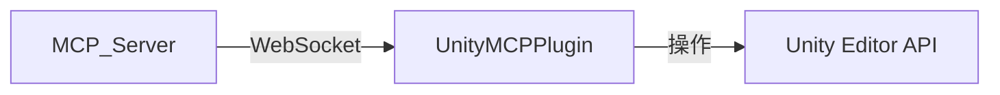

# Unity MCP Plugin

Unity Editor 側に導入するプラグインパッケージです。

## インストール

このディレクトリ (`UnityMCPPlugin`) を Unity プロジェクトの `Assets/` フォルダ内に配置してください。

## 構成

- **`package.json`**: Unity パッケージとしての定義情報。
- **`Editor/`**: エディタ拡張用のスクリプトが含まれます。

