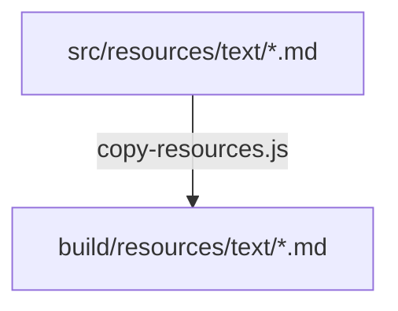

# Scripts

このディレクトリには、ビルドプロセスや開発を支援するユーティリティスクリプトが含まれています。

## ファイル一覧

### `copy-resources.js`

ビルド時に静的リソース（マークダウンファイルなど）を `src/` から `build/` ディレクトリにコピーするためのスクリプトです。

**動作の詳細:**
1.  TypeScript コンパイラ (`tsc`) は `.ts` ファイルのみをトランスパイルして出力します。
2.  `src/resources/text` にある `.md` ファイルなどは `tsc` によって無視されます。
3.  このスクリプトは、それらのファイルを `build/resources/text` に複製し、実行時にサーバーが正しくファイルを読み込めるようにします。

