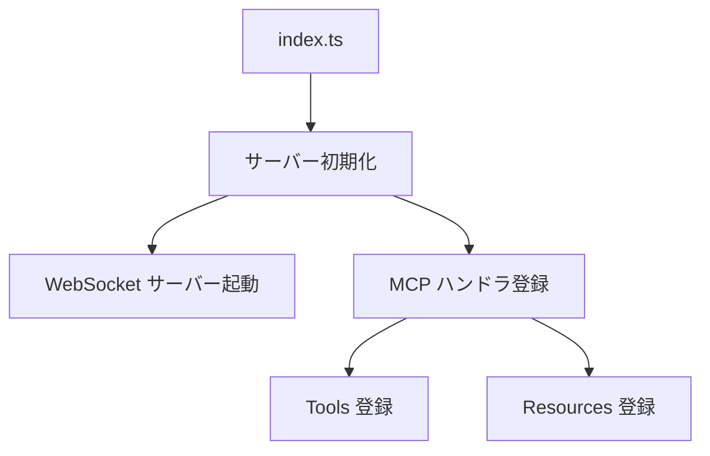

# Source Code

MCP サーバーのソースコードディレクトリです。

## ディレクトリ構造

| ディレクトリ | 説明 |
| :--- | :--- |
| `communication/` | Unity との WebSocket 通信を管理するロジックが含まれています。 |
| `resources/` | LLM に提供する静的テキストリソース（ドキュメントなど）を管理します。 |
| `tools/` | LLM が実行可能なツール（コマンド実行、ログ取得など）の定義と実装が含まれています。 |
| `index.ts` | アプリケーションのエントリーポイントです。サーバーの初期化と起動を行います。 |

## エントリーポイント (`index.ts`)

`UnityMCPServer` クラスが定義されており、以下の責務を持ちます：

1.  **MCP Server の初期化**: `@modelcontextprotocol/sdk` を使用してサーバーを立ち上げます。
2.  **WebSocket の待受**: `UnityConnection` クラスを使用してポート 8080 で待機します。
3.  **ハンドラの登録**: `CallToolRequestSchema` や `ListResourcesRequestSchema` などの MCP リクエストに対するハンドラを登録します。

