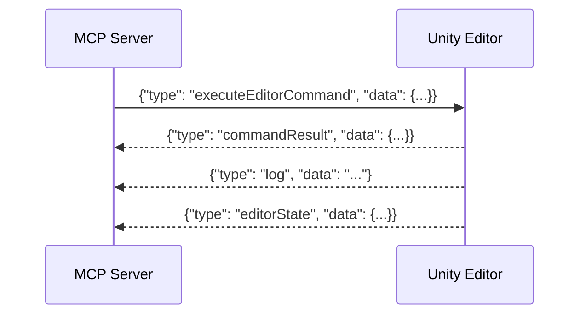

# Communication

Unity Editor との WebSocket 通信を管理するモジュールです。

## `UnityConnection` クラス

`ws` ライブラリを使用して WebSocket サーバー (ポート 8080) を立ち上げます。

### メッセージフロー

### 機能詳細

- **コマンド実行待機**: `execute_editor_command` が呼ばれると、Promise を作成し、Unity からの `commandResult` メッセージを受信するまで待機します。
- **ログバッファリング**: Unity から送られてくるログをメモリ上 (`logBuffer`) に保持し、`get_logs` ツールで取得できるようにします。
---
## For AI Agents: Operational Directives & Project Context

Please refer to [`AGENTS.md`](./AGENTS.md) for detailed operational directives and [`GEMINI.md`](./GEMINI.md) for a comprehensive project overview.