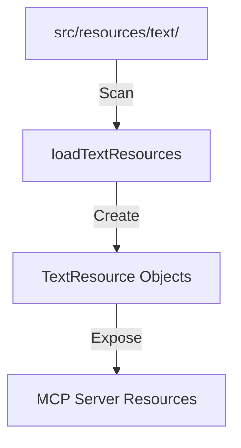

# Resources

MCP の「リソース」機能を提供するモジュールです。LLM に静的なコンテキスト（ドキュメントやガイドラインなど）を提供します。

## 仕組み

1.  **`TextResource` クラス**: ローカルのテキストファイルを読み込み、MCP リソース形式 (`uri`, `mimeType`, `text`) に変換します。
2.  **動的読み込み**: `loadTextResources` 関数は、指定されたディレクトリ（デフォルトは `text/`）をスキャンし、すべてのファイルをリソースとして登録します。

## 拡張方法

新しいテキストリソースを追加するには、単に `text/` ディレクトリにファイルを配置するだけです。サーバー再起動時に自動的に認識されます。
