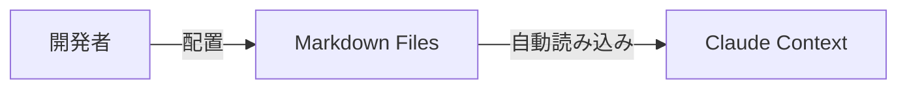

# Text Resources

ここに含まれるファイルは、MCP リソースとして Claude などの LLM クライアントに直接公開されます。

## 目的

LLM に VRChat や Unity の特定の知識、コーディング規約、ベストプラクティスを教えるためのドキュメントを配置します。

## ファイルの扱い

- **ビルド時**: `scripts/copy-resources.js` によって `build/resources/text` にコピーされます。
- **実行時**: `src/resources/index.ts` によって読み込まれます。

---
## For AI Agents: Operational Directives & Project Context

Please refer to [`AGENTS.md`](./AGENTS.md) for detailed operational directives and [`GEMINI.md`](./GEMINI.md) for a comprehensive project overview.