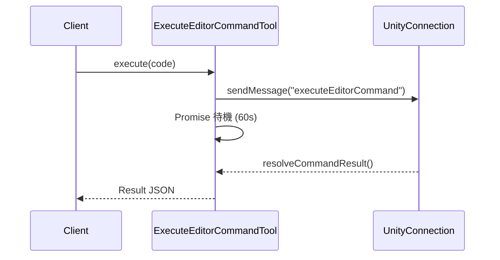

# Tools

MCP の「ツール」機能を提供するモジュールです。LLM が実行可能なアクションを定義します。

## 利用可能なツール

| ツール名 | 説明 |
| :--- | :--- |
| `execute_editor_command` | 任意の C# コードを Unity Editor 上でコンパイル・実行します。 |
| `get_editor_state` | Unity Editor の現在の状態（再生モード、シーン名など）を取得します。 |
| `get_logs` | Unity Editor のコンソールログを取得します。 |

## 実装詳細 (`ExecuteEditorCommandTool`)

このツールは最も強力で複雑な機能です。

1.  **コード受信**: クライアントから C# コード文字列を受け取ります。
2.  **送信**: WebSocket 経由で Unity に送信します。
3.  **待機**: `Promise.race` を使用して、Unity からの完了通知またはタイムアウト (60秒) を待ちます。
4.  **結果返却**: 実行結果、エラー、ログをまとめてクライアントに返します。

